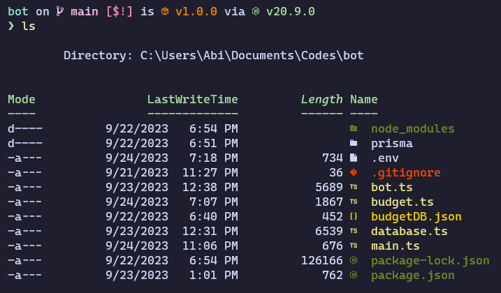
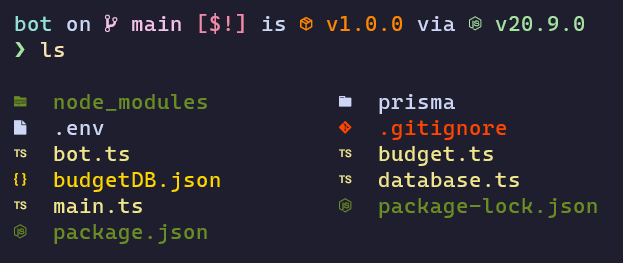

# PowerShell Profile Backup

This is mostly modified to my personal liking, but feel free to use it as a base for your own profile.

## Modules Used

- [Terminal-Icons](https://github.com/devblackops/Terminal-Icons) - Adds icons to the terminal for files and folders

> Note: There is a slight modification in format.ps1xml which can by activated by `fixls`.

|           Before            |           After            |
| :-------------------------: | :------------------------: |
|  |  |

- [z](https://github.com/badmotorfinger/z) - Jump around your filesystem

- [PoShFuck](https://github.com/mattparkes/PoShFuck) - Fuck around and find out.
